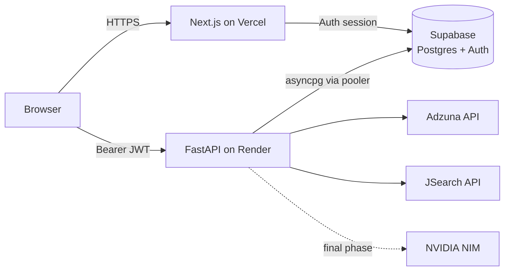

# Job Enhancer

**Every job in one place. Track everything. Apply faster.**

Job Enhancer is a job-search assistant that aggregates listings from multiple
job boards, lets you pull in jobs you found anywhere (LinkedIn, Indeed, a
company site) with one paste, tracks every application on a Kanban board with
follow-up reminders, and — in its final phase — tailors your resume and writes
cover letters with AI, then helps fill application forms via a companion
browser extension. It never auto-submits anything: the goal is to **amplify**
the job boards you already use, not replace them.

Built as a real, publicly hosted app (running entirely on free tiers) and as a
portfolio piece demonstrating spec-driven development end to end.

> **Status:** core product complete and tested; deploying next. AI quick-apply
> and the browser extension are the final build phases.
> Screenshots and the live demo link land here with the first deploy.

---

## Features

- 🔍 **Aggregated search** — one search across Adzuna + JSearch feeds,
  deduplicated (fuzzy title/company matching), with salary, remote,
  job-type, and experience-level filters
- 🔔 **Saved searches** — the app re-runs your searches daily and greets you
  with a "New Matches" feed
- 📌 **Add any job by link** — paste a URL from anywhere; it becomes a
  first-class tracked job
- 🗂️ **Collections** — organize saved jobs into folders you name
- 📋 **Kanban tracker** — 8 default pipeline stages plus your own custom
  stages, drag-and-drop, follow-up reminders when an application goes quiet
- ✅ **"Did you apply?"** — one-click confirmation when you return from an
  external apply page keeps the board honest
- 📊 **Analytics** — applications per week, response rate, interviews
- 🛡️ **Admin dashboard** — user stats and live health of every external
  service (owner-only)
- 👤 **Full account self-service** — email/password + Google/GitHub sign-in
  (Supabase Auth), JSON data export, and permanent account deletion
- 🤖 **AI quick-apply** *(final phase)* — NVIDIA-hosted Llama 3.3 tailors your
  resume and drafts cover letters per job, downloadable as PDF
- 🧩 **Browser extension** *(final phase)* — one-click "save to tracker" from
  any job page (v1) and application form auto-fill that never submits for
  you (v2)

## Tech Stack

| Layer | Technology | Why |
|---|---|---|
| Frontend | Next.js 16 (App Router) + TypeScript + Tailwind CSS v4 + shadcn/ui (Radix) | Industry-standard React stack; strict types end to end |
| Data fetching | TanStack Query v5 | Cache-first UX; optimistic Kanban updates |
| Backend | FastAPI (Python 3.11) + SQLAlchemy 2 async + Alembic | Async throughout; OpenAPI generated from code |
| Database + Auth | Supabase (PostgreSQL + Auth) | Free tier; email/password **and** OAuth without custom credential handling |
| Job data | Adzuna API + JSearch (RapidAPI) | Free tiers; results cached in Postgres to stretch quotas |
| AI *(final phase)* | NVIDIA NIM (`meta/llama-3.3-70b-instruct`) via LangChain | Free hosted inference |
| Testing | pytest (38 tests) · Vitest + Testing Library · Playwright | Contract-accurate fixtures; component + E2E layers |
| Hosting | Vercel + Render + Supabase — **$0/month** | Free tiers, kept awake by a scheduled ping |

## Architecture



- Supabase Auth issues the session; the frontend attaches the access token as
  a `Bearer` header, and FastAPI verifies it with the project JWT secret.
- All frontend↔backend traffic goes through the OpenAPI-documented `/v1` API
  ([contract](specs/001-job-search-mvp/contracts/openapi.yml) is regenerated
  from the live app; TypeScript types are generated from it at build time).
- Background jobs (APScheduler): hourly follow-up reminders, daily saved-search
  refresh, daily listing-expiry marking, daily purge of deleted accounts.

More detail in [docs/architecture.md](docs/architecture.md).

## Local Setup

Prerequisites: **Python 3.11+**, **Node.js 20+**, a free
[Supabase](https://supabase.com) project (2 minutes, no card — the free plan
allows two projects, so make `job-enhancer-dev` for local work and
`job-enhancer` for production).

```bash
git clone https://github.com/5Cl0ver/job_enhancer.git
cd job_enhancer
bash scripts/setup.sh        # installs backend venv + frontend deps, creates env files
```

Then fill in the env files:

1. **`backend/.env`** — from your dev Supabase project: the *Transaction
   pooler* connection string as `DATABASE_URL` (swap the prefix to
   `postgresql+asyncpg://`), `SUPABASE_URL`, `SUPABASE_JWT_SECRET`
   (Settings → API), plus [Adzuna](https://developer.adzuna.com) and
   [JSearch](https://rapidapi.com/letscrape-6bRBa3QguO5/api/jsearch) keys and
   your `ADMIN_EMAIL`.
2. **`frontend/.env.local`** — `NEXT_PUBLIC_SUPABASE_URL` and
   `NEXT_PUBLIC_SUPABASE_ANON_KEY` from the same project.

Run it:

```bash
# terminal 1 — API on :8000 (applies migrations first)
cd backend && .venv/bin/alembic upgrade head && .venv/bin/uvicorn app.main:app --reload

# terminal 2 — web app on :3000
cd frontend && npm run dev
```

Optional: `cd backend && .venv/bin/python scripts/seed_dev.py` loads sample
listings so search/tracker have data without hitting the job APIs.
Google/GitHub sign-in buttons need one-time provider setup in the Supabase
dashboard (Authentication → Providers); email/password works immediately.

## Tests

```bash
cd backend && .venv/bin/python -m pytest        # 38 API + service tests (in-memory DB)
cd frontend && npm run test                     # Vitest component tests
cd frontend && npx playwright test              # E2E against your running local stack
```

CI (GitHub Actions) runs Ruff, pytest, ESLint, `tsc`, Vitest, and the
production build on every push. E2E specs run against a live stack; signed-in
scenarios activate when `E2E_EMAIL`/`E2E_PASSWORD` are set.

## Deployment ($0/month)

| Piece | Service | How |
|---|---|---|
| Frontend | Vercel (Hobby) | Import repo, set root directory to `frontend/`, add the `NEXT_PUBLIC_*` env vars |
| Backend | Render (free) | Blueprint in [render.yaml](render.yaml) — Docker deploy with health checks and auto-deploy on push |
| Database + Auth | Supabase (free) | Production project; URL/keys go into Render + Vercel env |
| Keep-awake | GitHub Actions | [keep-alive.yml](.github/workflows/keep-alive.yml) pings the API every 10 min (set the `BACKEND_URL` repo variable) |

Free-tier honesty: Render free sleeps after 15 idle minutes (the ping prevents
it), Supabase free pauses after 7 idle days (daily scheduled jobs prevent it),
and JSearch allows ~200 requests/month (interactive searches only — scheduled
refreshes are Adzuna-only by design).

## Project Structure

```
backend/     FastAPI app — models, services, /v1 routers, Alembic migrations, pytest suite
frontend/    Next.js app — App Router pages, components, TanStack Query hooks, tests
specs/       Spec-driven development artifacts: spec, plan, tasks, contracts
docs/        Architecture notes
scripts/     setup.sh (one-time local setup)
render.yaml  Render deploy blueprint
```

This project is built spec-first with [Spec Kit](https://github.com/github/spec-kit):
the [specification](specs/001-job-search-mvp/spec.md) defines *what*, the
[plan](specs/001-job-search-mvp/plan.md) defines *how*, and
[tasks.md](specs/001-job-search-mvp/tasks.md) tracks every unit of work.

## Roadmap

1. ✅ Core product: search, saved searches, collections, tracker, analytics, admin
2. 🔜 Deploy to Vercel + Render + Supabase (live link here)
3. 🔜 AI quick-apply: resume tailoring + cover letters + PDF export
4. 🔜 Browser extension v1 "job catcher", then v2 form auto-fill
